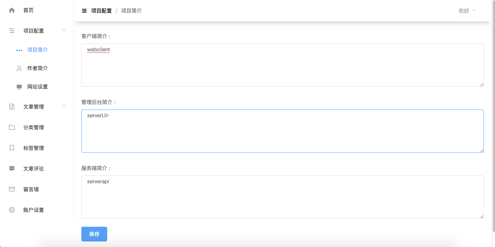
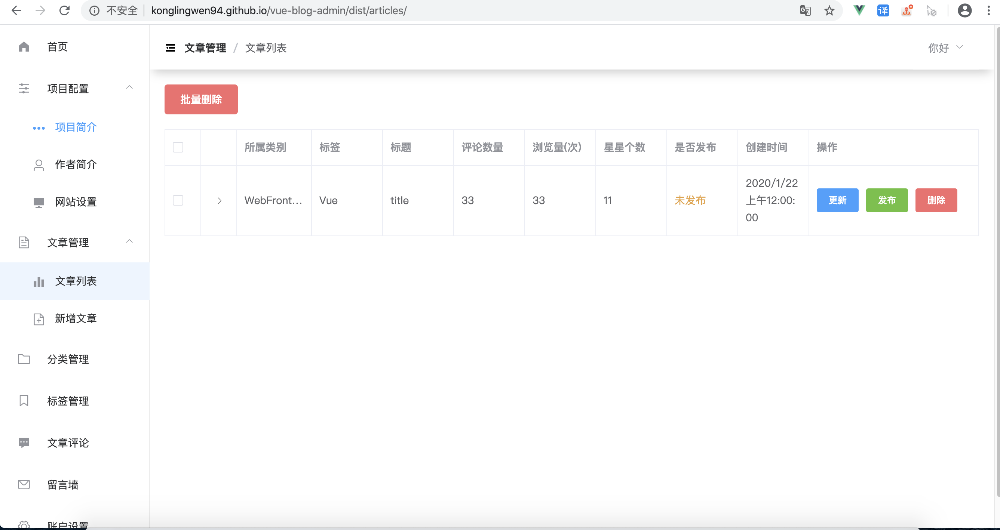
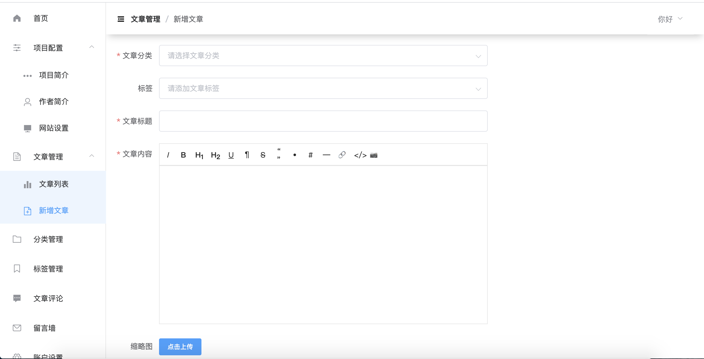
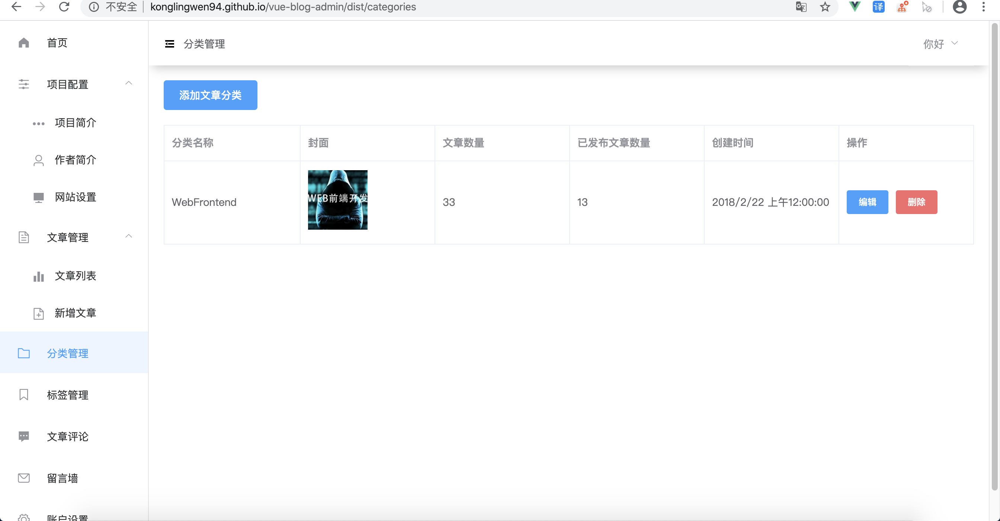
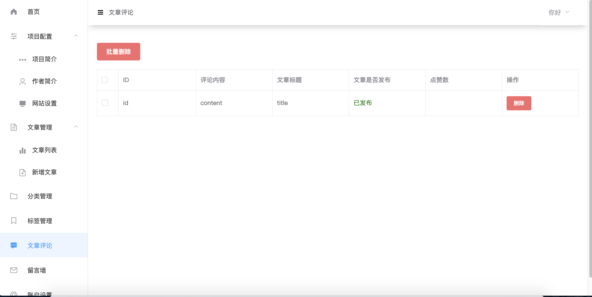
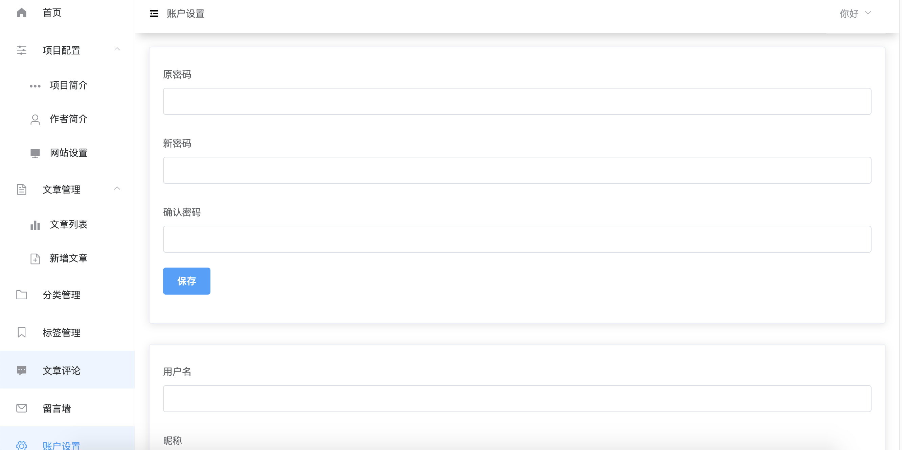

# vue-blog-admin
A beautiful back management system based on Vue

## Online preview

线上地址: <https://konglingwen94.github.io/vue-blog-admin/>

备用地址: <http://123.56.124.33:8080/>


## Project setup
```
npm install
```

### Compiles and hot-reloads for development
```
npm run dev
```

### Compiles and minifies for production
```
npm run build
```

## Screenshots

<br>
<br>
<br>
<br>
<br>
<br>


 

 
